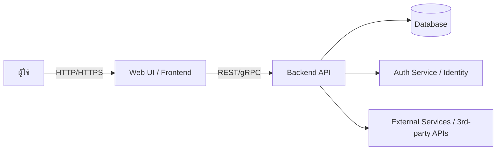

# สถาปัตยกรรมระบบ (Architecture)

## บทนำ
เอกสารนี้สรุปสถาปัตยกรรมระดับสูงของระบบที่พัฒนาภายในโครงการ เพื่อให้ทีมเข้าใจภาพรวมของส่วนประกอบ การไหลของข้อมูล การตัดสินใจเชิงเทคนิค และข้อพิจารณาด้านความปลอดภัย/การปรับใช้

## วัตถุประสงค์
- ให้ภาพรวมของโครงสร้างระบบและความรับผิดชอบของแต่ละส่วน
- ระบุการตัดสินใจเชิงเทคนิคที่สำคัญ
- ระบุความต้องการที่ไม่ใช้งาน (เช่น ความสามารถในการขยาย, ความปลอดภัย)

## มุมมองระดับสูง

## ส่วนประกอบหลัก
- Web UI: ส่วนติดต่อผู้ใช้ (SPA หรือ Multi-page) รับอินพุตจากผู้ใช้และเรียก API
- Backend API: บริการหลักที่ประมวลผลตรรกะ ทำงานธุรกิจ และเชื่อมต่อกับฐานข้อมูล
- Database: ที่เก็บข้อมูลถาวร (เช่น PostgreSQL / MySQL / MongoDB ตามความต้องการ)
- Auth Service: การพิสูจน์ตัวตนและอนุญาต (JWT / OAuth2, หรือเชื่อมต่อ Identity Provider)
- External Integrations: บริการภายนอก (เช่น payment gateway, notification)
- CI/CD: กระบวนการ build, test, deploy อัตโนมัติ

## การไหลของข้อมูล (ตัวอย่าง)
1. ผู้ใช้ทำคำขอจาก Web UI
2. Web UI เรียก Backend API พร้อม access token
3. Backend ตรวจสอบสิทธิ์ -> ประมวลผล -> อ่าน/เขียนข้อมูลใน Database
4. Backend ตอบผลกลับไปยัง Web UI

## การปรับใช้ (Deployment)
- สภาพแวดล้อม: `development`, `staging`, `production`
- แนะนำให้บรรจุเป็น container (Docker) และจัดการด้วย orchestration (Kubernetes) หรือใช้ PaaS (เช่น Azure App Service, AWS Elastic Beanstalk)
- Configuration: แยก config ต่อ environment และเก็บความลับใน Secret Manager

## การตัดสินใจด้านเทคโนโลยี (ตัวอย่าง)
- Backend: Python (FastAPI/Flask) หรือ Node.js (Express/Nest) — ขึ้นกับทีม
- Database: PostgreSQL (ความสอดคล้อง) หรือ MongoDB (เอกสาร)
- Auth: OAuth2 + JWT; ใช้ identity provider เมื่อเป็นไปได้
- Communication: REST หรือ gRPC สำหรับบริการภายในที่ต้องการประสิทธิภาพ

## ข้อกำหนดที่ไม่ใช้งาน
- Scalability: รองรับการขยายตามแนวนอนสำหรับ API และ Worker
- Availability: ใช้กลยุทธ์ health checks และ replication สำหรับ DB
- Performance: ตอบสนองภายใน < 300ms สำหรับ API หลัก (เป้าหมาย)
- Security: ข้อมูลสำคัญต้องเข้ารหัสทั้งขณะส่งและขณะจัดเก็บ

## ความปลอดภัย
- ใช้ HTTPS/TLS ทั้งระบบ
- จัดการความลับด้วย Secret Manager
- จำกัดสิทธิ์บริการด้วย Principle of Least Privilege
- บันทึกและติดตามเหตุการณ์ (logging + monitoring + alerting)

## การสังเกตการณ์ (Observability)
- Metrics: เก็บ telemetry สำคัญ (latency, error rate, throughput)
- Tracing: ใช้ distributed tracing เมื่อต้องการวิเคราะห์การเรียกข้ามบริการ
- Logs: รวม logs และตั้ง retention/rotation

## ข้อพิจารณา/คำถามที่เปิดอยู่
- เลือกเทคโนโลยี backend ตัวใดเป็นหลัก?
- ต้องการรองรับการสเกลแบบ real-time หรือไม่ (WebSocket)?
- ขอบเขตข้อมูลที่ต้องเข้ารหัส/ปกป้องระดับสูงคืออะไร?

---
เอกสารนี้เป็นจุดเริ่มต้นสำหรับการออกแบบเชิงสถาปัตยกรรม และควรปรับปรุงเมื่อมีข้อกำหนดหรือการตัดสินใจใหม่ๆ
